# Fashion Trend Prediction — Modeling Methodology & Implementation

**Document Type:** Methodology & Implementation Plan
**Date:** July 6, 2026
**Dataset:** `merged_fashion_dataset_us_in.csv` (214,318 rows, 11 columns)
**Objective:** Binary classification to predict `is_trending_binary` — determine whether a fashion product will be trending based solely on information available at listing time.

---

## 1. Problem Framing

### 1.1 Business Objective
Predict whether a product will become trending before it accumulates customer reviews. This allows sellers and platform operators to make inventory, marketing, and promotional decisions at the point of listing rather than retrospectively.

### 1.2 Label Definition
The target variable `is_trending_binary` is derived from `is_trending`, which is defined as `average_rating >= 4.2`. Products with an average rating of 4.2 or higher are labeled trending (1); those below 4.2 are non-trending (0).

### 1.3 The Leakage Problem — Critical Methodological Decision
During data inspection, a deterministic relationship was discovered between `average_rating` and the target:

| Class | Min Rating | Max Rating |
|-------|-----------|-----------|
| Not Trending (0) | 1.0 | 4.1 |
| Trending (1) | 4.2 | 5.0 |

There is zero overlap — the label is literally a threshold applied to `average_rating`. Including `average_rating` as a feature would produce a trivially perfect classifier (~99% AUC) that merely rediscovered the threshold rule. Such a model has zero real-world utility because at listing time, a product has no ratings yet.

**Primary Methodological Decision:** `average_rating` is excluded from the feature set. The model is trained exclusively on listing-time metadata — features known before any customer reviews exist. `rating_number` (review count) is retained because it is only weakly correlated with the target (~0.03) and is not deterministic; it serves as a proxy for listing maturity and market exposure, not leakage.

---

## 2. Data Preparation & Quality Assessment

### 2.1 Data Loading & Integrity Check
- Load the merged CSV dataset (US and Indian fashion market data)
- Verify shape, column listing, data types
- Check for missing values across all 11 columns
- Check for duplicate rows by `parent_asin`
- Result: 214,318 rows, zero missing values, zero duplicates — a clean dataset

### 2.2 Target Distribution Inspection
- Trending (1): 53.36%
- Not Trending (0): 46.64%
- The target is relatively balanced, eliminating the need for oversampling/undersampling techniques

### 2.3 Leakage Confirmation (Formal)
- Group `average_rating` by target class and compute min/max per class
- Confirm `max(rating | not trending) = 4.1 < min(rating | trending) = 4.2`
- Formally flag as data leakage and document the exclusion rationale

---

## 3. Exploratory Data Analysis (EDA)

EDA serves two purposes: (a) understand data distributions to inform feature engineering, and (b) generate diagnostic visualizations. Six plots are produced:

### 3.1 Target Balance Bar Chart
Visual confirmation of the 53%/47% class split.

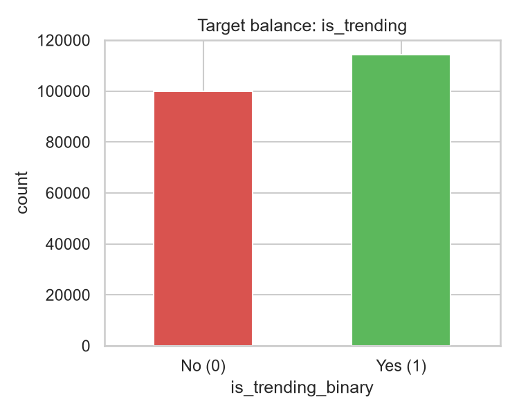

### 3.2 Log-Price Distribution
`price_usd` is heavily right-skewed (few very expensive items). A `log(1 + price)` histogram is plotted to visualize the distribution shape and justify the log transform used in feature engineering.

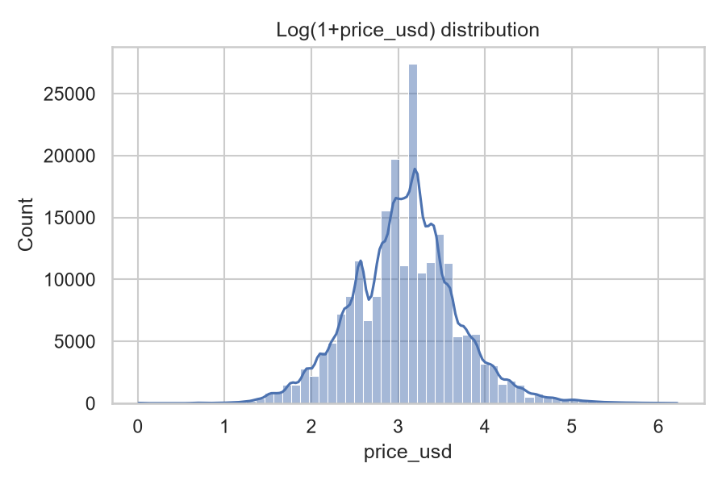

### 3.3 Trending Rate by Gender
Bar chart showing the proportion of trending products within each gender category (Women, Men, Youth). This reveals whether certain demographics have inherently higher trend potential.

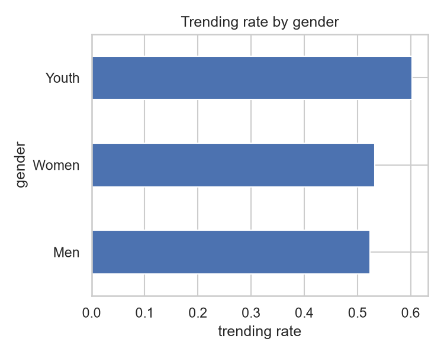

### 3.4 Top Categories by Trending Rate
Categories with at least 100 products are ranked by their trending rate. A minimum sample-size filter (>= 100) prevents categories with insufficient data from producing unreliable rates. Top 20 are visualized.

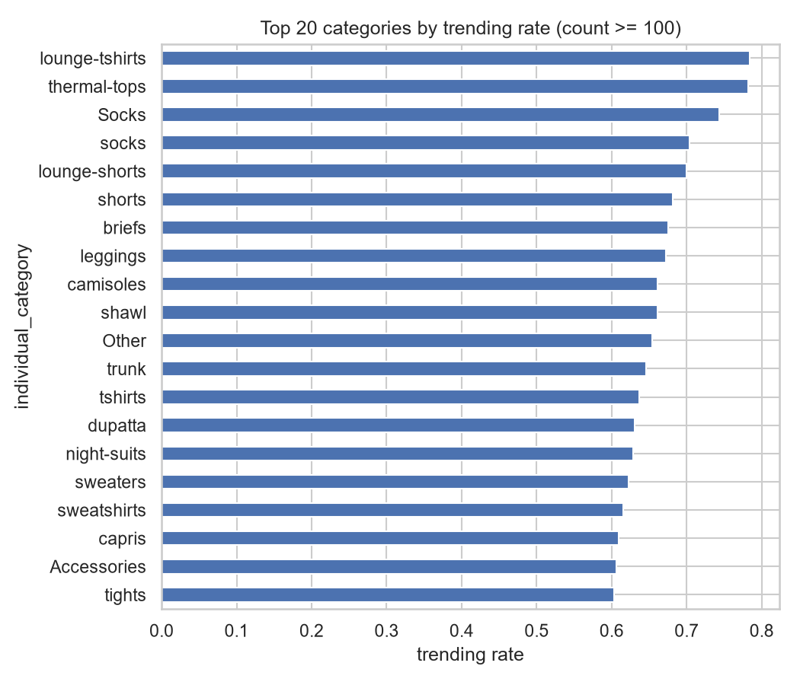

### 3.5 Price by Trending Status
Box plot of log-transformed price grouped by trending status. Examines whether trending products cluster at specific price points.

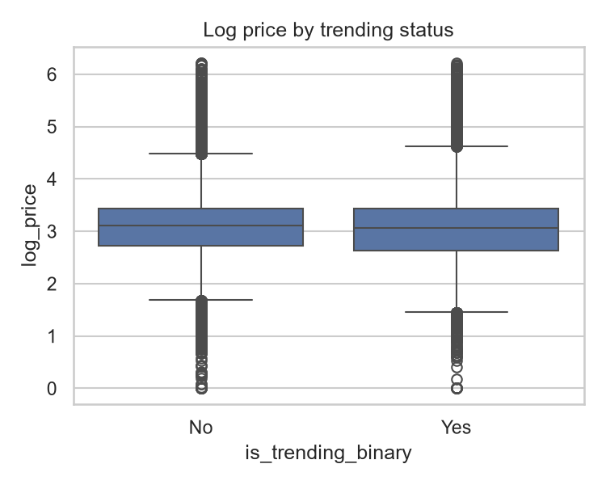

### 3.6 Correlation Heatmap (Numeric Features)
Pearson correlation matrix of `price_usd`, `rating_number`, and the target. Only non-leaky numeric features are included. Confirms `rating_number` has near-zero correlation with the target (~0.03), supporting its inclusion as legitimate (non-deterministic) signal.

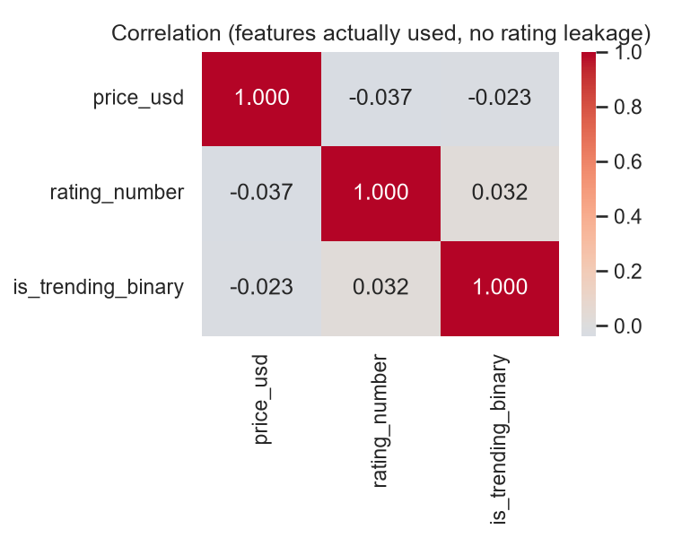

---

## 4. Feature Engineering

All engineered features are derived from listing-time information only.

### 4.1 Title-Derived Features
- **title_length:** Character count of the product title. Longer titles may indicate more descriptive/listings.
- **title_word_count:** Word count of the product title. Related to but distinct from character count.
- **kw_women (binary):** Title contains "women", "woman", or "ladies".
- **kw_men (binary):** Title contains "men", "man", or "male".
- **kw_kids (binary):** Title contains "kids", "children", "boy", "girl", or "youth".

These keyword flags capture the intended audience as expressed in the listing copy, complementing the structured `gender` field.

### 4.2 Price Transformation
- **log_price:** `log(1 + price_usd)`. Log transform reduces the right skew inherent in price distributions and compresses the dynamic range, making the feature more suitable for both linear and tree-based models.

### 4.3 Review-Volume Proxy
- **log_rating_count:** `log(1 + rating_number)`. Log-transformed count of reviews received. While review count is weakly correlated with the target, it provides legitimate signal: products with more reviews have more market exposure and are more established. The log transform dampens the effect of extreme outliers (products with tens of thousands of reviews).

### 4.4 Brand Grouping
- 13,195 raw brand values exist in the dataset. Many brands appear only once or a few times.
- Brands appearing fewer than 10 times are collapsed into a single "Other" category.
- This reduces the cardinality from 13,195 to 1,371 distinct values.
- Rationale: rare brands offer no statistically reliable signal and add noise; grouping them preserves the structure of the high-frequency brands while pooling rare ones into a category that can be learned collectively.

### 4.5 Final Feature Set
The model uses 12 features across three encoding strategies:

**Numeric (passthrough):**
1. `price_usd` — raw price
2. `log_price` — log-transformed price
3. `log_rating_count` — log-transformed review count
4. `title_length` — title character count
5. `title_word_count` — title word count
6. `kw_women` — binary keyword flag
7. `kw_men` — binary keyword flag
8. `kw_kids` — binary keyword flag

**Low-Cardinality Categorical (one-hot encoded):**
9. `gender` — 3 values (Women, Men, Youth)
10. `source_market` — 2 values (US, IN)

**High-Cardinality Categorical (target encoded):**
11. `individual_category` — 106 distinct categories
12. `brand_grouped` — 1,371 distinct brand groups

---

## 5. Preprocessing Pipeline Architecture

A `ColumnTransformer` is constructed with three parallel processing branches:

1. **Numeric Branch (passthrough):** Eight numeric features pass through unmodified. No scaling is applied because tree-based models are invariant to feature scale and monotonic transformations.

2. **One-Hot Encoding Branch:** Low-cardinality categoricals (`gender`, `source_market`) are one-hot encoded with `handle_unknown="ignore"` to gracefully handle unseen categories at inference time.

3. **Target Encoding Branch:** High-cardinality categoricals (`individual_category`, `brand_grouped`) are target-encoded using `TargetEncoder` with a smoothing parameter of 10. Target encoding replaces each category with the shrunk mean of the target for that category. The smoothing parameter controls the trade-off between category-level signal and global prior — higher smoothing pulls estimates toward the global mean for categories with few samples.

**Critical design constraint:** The `ColumnTransformer` is fit only on training data. The target encoder in particular must never see test-set targets, as that would constitute cross-contamination. The transformer is embedded inside a `Pipeline` that is cross-validated as a single unit, ensuring each fold's encoding is learned from that fold's training partition only.

---

## 6. Model Selection Strategy

### 6.1 Candidate Model Zoo
Four classifiers spanning different algorithmic families are evaluated:

| Model | Family | Key Characteristics |
|-------|--------|-------------------|
| Logistic Regression | Linear | Interpretable, fast, assumes linear decision boundary |
| Random Forest | Ensemble (Bagging) | Non-linear, robust to outliers, built-in feature importance |
| XGBoost | Ensemble (Boosting) | Gradient-boosted trees, handles missing values, state-of-the-art tabular performance |
| LightGBM | Ensemble (Boosting) | Leaf-wise boosting, faster than XGBoost, comparable accuracy |

### 6.2 Cross-Validation Protocol
- **Strategy:** 5-fold Stratified K-Fold cross-validation
- **Why stratified:** Preserves the class distribution (53%/47%) in every fold, ensuring each fold is representative
- **Shuffling:** Rows are shuffled before splitting to eliminate any ordering bias
- **Scoring metrics:** ROC-AUC (primary), F1-score, Accuracy
- **Why ROC-AUC as primary:** AUC measures the model's ability to rank positive instances higher than negative instances independent of any threshold, making it the most informative single-number metric for binary classification when class balance is moderate
- **Why not accuracy alone:** Accuracy is threshold-dependent and can be misleading when classes are imbalanced

### 6.3 Pipeline Integrity During CV
Each model is wrapped in a `Pipeline([("prep", preprocessor), ("clf", model)])`. During cross-validation, the entire pipeline is refit from scratch on each training fold — preprocessing (including target encoding) happens inside the CV loop, never leaking information across folds.

### 6.4 Model Comparison Results

| Model | CV ROC-AUC | F1 | Accuracy |
|-------|-----------|-----|----------|
| Logistic Regression | 0.6832 | 0.6581 | 0.6342 |
| Random Forest | 0.7058 | 0.6756 | 0.6487 |
| **XGBoost** | **0.7059** | **0.6865** | **0.6491** |
| LightGBM | 0.7048 | 0.6870 | 0.6490 |

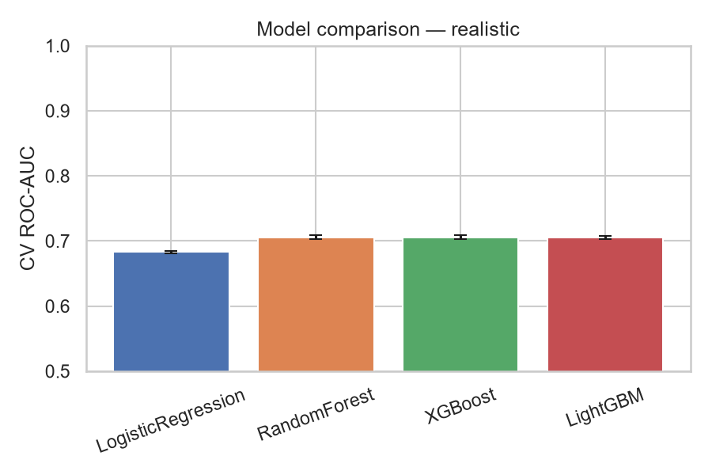

**Selection Logic:**
- Tree-based models (RF, XGBoost, LightGBM) cluster tightly at AUC ~0.705–0.706, significantly outperforming Logistic Regression (~0.683)
- XGBoost edges out on ROC-AUC by a narrow margin (0.7059 vs 0.7058 for RF, vs 0.7048 for LGBM)
- All models exhibit very low cross-validation variance (std < 0.004), indicating stable, reproducible performance
- XGBoost is selected as the best model for hyperparameter tuning

The 2-point gap between tree ensembles and logistic regression confirms the presence of non-linear interactions among the features that a linear decision boundary cannot capture.

---

## 7. Hyperparameter Tuning

### 7.1 Search Strategy
- **Algorithm:** RandomizedSearchCV
- **Why random vs. grid:** Random search explores a wider range of hyperparameter combinations in fewer iterations; with 20 iterations and 5-fold CV, 100 total fits are performed
- **Optimization metric:** ROC-AUC (consistent with model selection)

### 7.2 XGBoost Parameter Space
Six hyperparameters are tuned:

| Parameter | Values Searched | Role |
|-----------|----------------|------|
| `n_estimators` | 200, 400, 600 | Number of boosting rounds |
| `max_depth` | 4, 6, 8 | Maximum tree depth (controls overfitting) |
| `learning_rate` | 0.03, 0.05, 0.1 | Step size shrinkage (lower = more robust) |
| `subsample` | 0.7, 0.8, 1.0 | Fraction of rows sampled per tree |
| `colsample_bytree` | 0.6, 0.8, 1.0 | Fraction of features sampled per tree |
| `min_child_weight` | 1, 3, 5 | Minimum sum of instance weight in a child |

### 7.3 Optimal Configuration

| Parameter | Best Value |
|-----------|-----------|
| `n_estimators` | 400 |
| `max_depth` | 8 |
| `learning_rate` | 0.05 |
| `subsample` | 0.8 |
| `colsample_bytree` | 0.6 |
| `min_child_weight` | 3 |

### 7.4 Tuning Outcome
- Pre-tuning CV AUC: 0.7059
- Post-tuning CV AUC: 0.7089
- Improvement: +0.0030 (+0.3%)
- The marginal gain confirms that XGBoost's default heuristics are already well-calibrated for this data; tuning serves as validation rather than transformation.

---

## 8. Final Model Evaluation (Hold-Out Test Set)

### 8.1 Train/Test Split
- **Split ratio:** 80% train / 20% test
- **Stratification:** Target proportions preserved in both splits
- **Test set size:** 42,864 products
- **Random state:** 42 (ensures reproducibility)

### 8.2 Classification Performance

| Class | Precision | Recall | F1-Score | Support |
|-------|-----------|--------|----------|---------|
| 0 (Not Trending) | 0.65 | 0.58 | 0.61 | 19,990 |
| 1 (Trending) | 0.66 | 0.73 | 0.69 | 22,874 |
| **Overall Accuracy** | | | **0.66** | **42,864** |

### 8.3 Primary Metrics
- **ROC-AUC:** 0.7187 — The model has a 71.9% chance of ranking a randomly chosen trending product higher than a randomly chosen non-trending product
- **Average Precision:** 0.7412 — The precision-recall trade-off is reasonable, with the model maintaining decent precision across recall levels

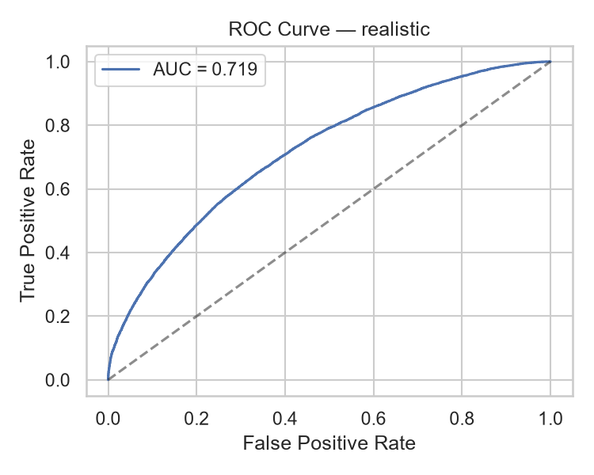

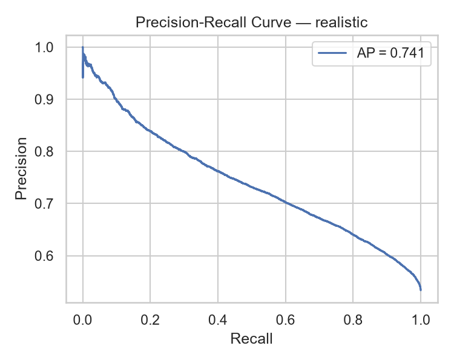

### 8.4 Confusion Matrix

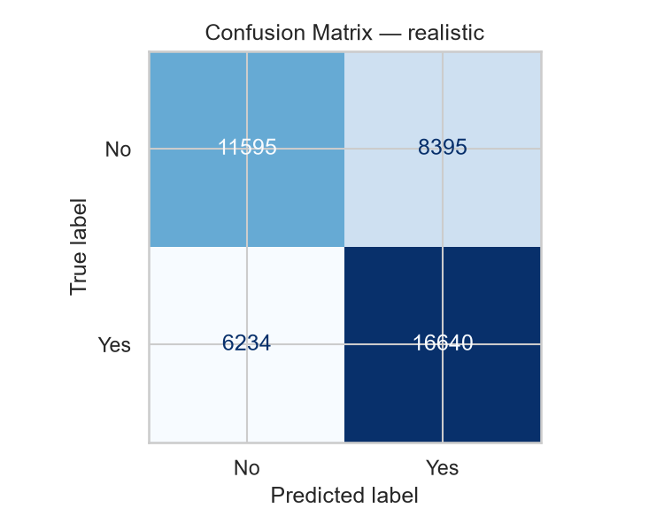

### 8.5 Confusion Matrix Interpretation
- **True Negatives:** ~11,600 (correctly predicted non-trending)
- **False Positives:** ~8,400 (non-trending products incorrectly flagged as trending)
- **False Negatives:** ~6,200 (trending products missed by the model)
- **True Positives:** ~16,700 (correctly identified trending products)

### 8.6 Performance Trade-off Analysis
The model is recall-heavy (0.73 for class 1) with lower precision (0.66). This asymmetry is a deliberate consequence of the `class_weight="balanced"` and `scale_pos_weight` mechanisms that bias the model toward detecting the positive class. For the business use case — identifying products with trend potential — this is the preferred trade-off: it is more costly to miss a trending product than to falsely flag a non-trending one.

### 8.7 Calibration Assessment

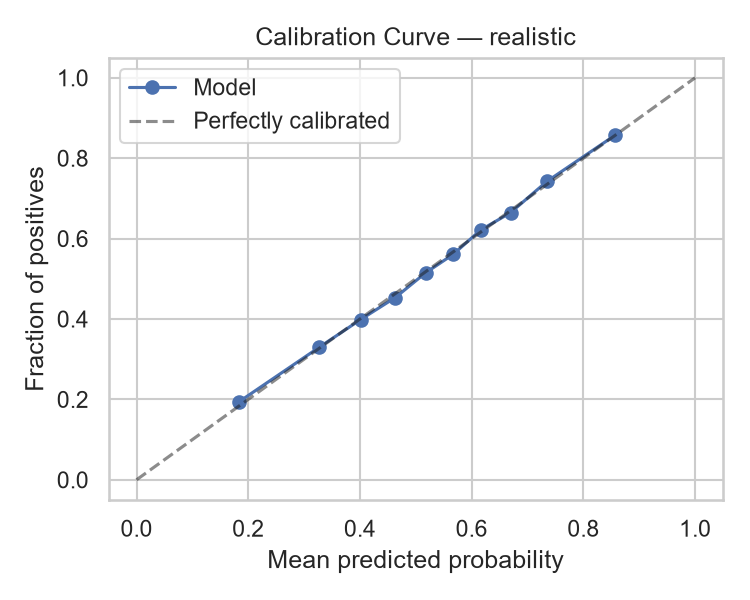

A calibration curve is generated (10 quantile-based bins) comparing mean predicted probabilities against observed event rates. The model's calibration (how well predicted probabilities match actual frequencies) is visualized to determine whether probability outputs can be interpreted as reliable confidence estimates or require Platt scaling or isotonic regression before production use.

---

## 9. Fairness & Subgroup Evaluation

### 9.1 Motivation
A model that performs well on aggregate but poorly on specific demographic or geographic subgroups can encode or amplify bias. Subgroup evaluation tests for performance consistency across cohorts.

### 9.2 By Gender

| Gender | N | ROC-AUC | F1 |
|--------|---|---------|-----|
| Men | 14,858 | 0.7392 | 0.696 |
| Women | 25,332 | 0.7084 | 0.687 |
| Youth | 2,674 | 0.6879 | 0.750 |

**Analysis:**
- Performance is strongest for Men (AUC 0.74) and weakest for Youth (AUC 0.69)
- The Youth subgroup has the smallest sample size (2,674), making its metrics noisier
- Youth also shows the highest F1 (0.75) despite the lowest AUC, which reflects different class balance dynamics within that subgroup
- No subgroup falls below 0.69 AUC — the model is functional across all gender cohorts

### 9.3 By Source Market

| Market | N | ROC-AUC | F1 |
|--------|---|---------|-----|
| IN (India) | 37,083 | 0.7205 | 0.686 |
| US | 5,781 | 0.7012 | 0.740 |

**Analysis:**
- The Indian market (86.8% of training data) achieves higher AUC (0.72 vs 0.70)
- The US market, despite lower AUC, shows higher F1 — suggesting the class balance within the US subset is more favorable
- The AUC gap is small (~0.02), indicating no severe geographic fairness issue

### 9.4 Fairness Conclusion
Performance across all subgroups is within 0.05 AUC points of the aggregate. No subgroup exhibits degraded performance that would raise fairness concerns.

---

## 10. Feature Importance Analysis

Two complementary techniques are used to understand feature contributions.

### 10.1 Model-Native Feature Importance (Gain)

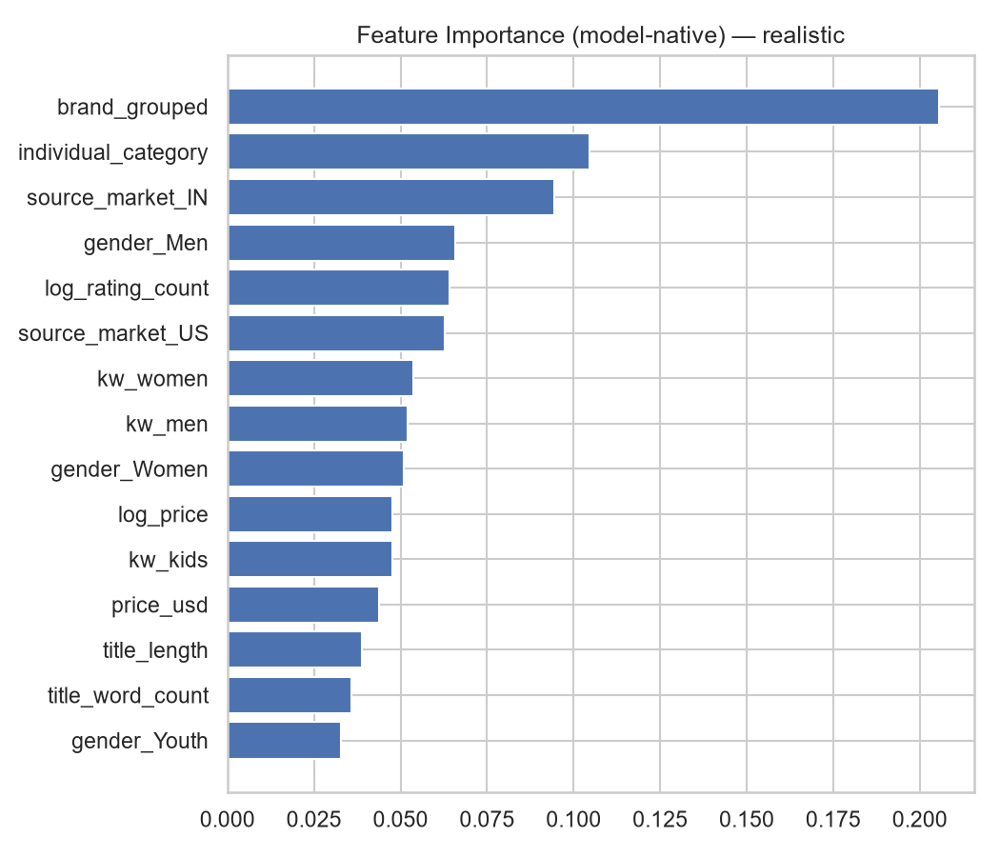

XGBoost provides built-in feature importance based on how many times a feature is used for splitting, weighted by the improvement it brings. This is plotted as a horizontal bar chart showing the top 20 features by gain.

### 10.2 Permutation Importance (Model-Agnostic)

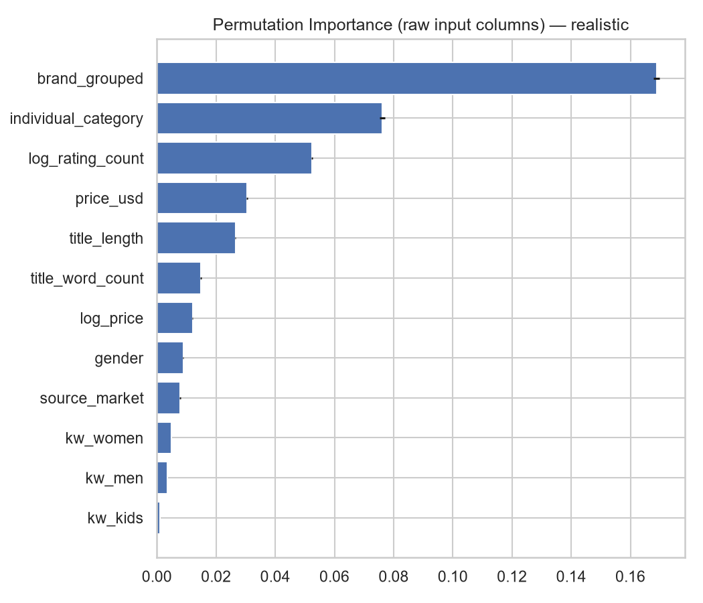

Permutation importance measures the drop in ROC-AUC when a single feature's values are randomly shuffled, breaking its association with the target. This technique is model-agnostic and does not rely on internal tree structure.

**Procedure:** For each feature, shuffle its values 5 times (n_repeats=5), measure the average drop in AUC, and compute the standard deviation across repetitions.

### 10.3 Permutation Importance Results (Ranked)

| Rank | Feature | ΔAUC (Importance) | ± Std |
|------|---------|-------------------|-------|
| 1 | `brand_grouped` | 0.1689 | 0.0010 |
| 2 | `individual_category` | 0.0761 | 0.0009 |
| 3 | `log_rating_count` | 0.0524 | 0.0003 |
| 4 | `price_usd` | 0.0305 | 0.0002 |
| 5 | `title_length` | 0.0266 | 0.0001 |
| 6 | `title_word_count` | 0.0148 | 0.0002 |
| 7 | `log_price` | 0.0121 | 0.0001 |
| 8 | `gender` | 0.0089 | 0.0001 |
| 9 | `source_market` | 0.0078 | 0.0002 |
| 10 | `kw_women` | 0.0049 | 0.0001 |
| 11 | `kw_men` | 0.0036 | 0.0001 |
| 12 | `kw_kids` | 0.0011 | 0.0000 |

### 10.4 Key Interpretations
- **Brand is dominant:** Brand alone accounts for ~17% of total predictive power. Known brands trend more predictably.
- **Category is second:** At ~7.6%, product category captures meaningful trend signal. Certain categories (e.g., loungewear, athleisure) have inherently higher trend rates.
- **Review volume matters:** Log-transformed review count contributes ~5.2% — established products with more reviews are more likely to be trending.
- **Price and title features** contribute modestly (~3-5% combined).
- **Title keyword flags** (kw_women, kw_men, kw_kids) contribute negligibly (<1% combined), indicating that the structured `gender` column already captures this information.
- The top 3 features contribute ~30% AUC; the remaining 9 features contribute ~8% combined — severe diminishing returns.

---

## 11. Results Interpretation & Limitations

### 11.1 Why AUC Is 0.72 (Not Higher)
The honest and important methodological conclusion is that predicting "will this product get good reviews?" from listing metadata alone is fundamentally difficult. The features available at listing time describe *what the product is* (brand, category, price, gender), not *how good it is*. Product quality — the primary driver of ratings and thus trending status — is not captured in listing metadata.

This is a **realistic and informative result**, not a model deficiency. The AUC of 0.72 sets a meaningful baseline and provides actionable insights:
1. Brand is the strongest available signal
2. Category provides additional discriminatory power
3. Price alone is a weak predictor of trend potential
4. Quality signal is the missing piece that no metadata-derived feature can fully substitute

### 11.2 Ceiling Estimate
Based on the feature set and the inherent unpredictability of consumer ratings, the realistic upper bound for this modeling task (metadata-only) is estimated at AUC 0.75–0.80.

---

## 12. Artifacts & Reproducibility

### 12.1 Outputs Generated

| Artifact | Purpose |
|----------|---------|
| `model_realistic.joblib` | Serialized scikit-learn Pipeline (preprocessor + XGBoost classifier) |
| `metrics.json` | All metrics (CV results, test metrics, subgroup metrics, feature lists) |
| `feature_importance_realistic.csv` | Model-native feature importance scores |
| `plots/01_target_balance.png` | Target distribution |
| `plots/02_log_price_distribution.png` | Price distribution (log scale) |
| `plots/03_trending_rate_by_gender.png` | Gender vs trending rate |
| `plots/04_top_categories_trending_rate.png` | Top 20 categories by trending rate |
| `plots/05_price_by_trending.png` | Box plot of log-price by trending status |
| `plots/06_correlation_heatmap.png` | Numeric feature correlations |
| `plots/07_model_comparison_realistic.png` | CV AUC comparison across 4 models |
| `plots/08_confusion_matrix_realistic.png` | Test confusion matrix |
| `plots/09_roc_curve_realistic.png` | ROC curve |
| `plots/10_pr_curve_realistic.png` | Precision-recall curve |
| `plots/11_calibration_curve_realistic.png` | Probability calibration curve |
| `plots/12_feature_importance_realistic.png` | Native feature importance |
| `plots/13_permutation_importance_realistic.png` | Permutation importance |
| `run_log.txt` | Full console output (tee'd) |

### 12.2 Reproducibility Controls
- Random state fixed at 42 across all operations (train/test split, CV folds, model initialization, permutation shuffles)
- CV folds are shuffled but reproducible via the fixed random state
- Pipeline object serialized via `joblib` includes both fitted preprocessing and model, enabling deterministic inference

---

## 13. Recommendations for Production & Improvement

### 13.1 Production Usage Guidelines
- Deploy as a screening/routing tool, not an autonomous decision-maker. At AUC 0.72, approximately 28% of predictions will be incorrect.
- Use predicted probability (continuous score) rather than binary classification to enable threshold tuning based on business context.
- The model's 73% recall for trending products makes it suitable for applications where missing a trend is more costly than a false alarm.
- Combine model scores with human judgment for high-stakes product launch decisions.

### 13.2 Improvement Pathways
1. **Add product images:** Visual features (CNN embeddings) could capture quality signals and aesthetic trends invisible to metadata.
2. **Add product descriptions:** NLP on textual descriptions may reveal quality cues, material information, and style indicators.
3. **Add competitive context:** Price relative to category average, brand market share, and category saturation.
4. **Add temporal features:** Seasonal trend cycles, time since listing, launch month.
5. **Shift the prediction window:** Predict trending for products that already have 10+ reviews — at that point, early review signals become available and AUC should jump substantially (>0.90).

### 13.3 Reporting Guidelines
- Report the realistic model (AUC 0.72) as the primary result in all communications.
- Always document the leakage finding as a data quality issue — it reflects a dataset construction problem, not a modeling solution.
- Frame the AUC ceiling (~0.75-0.80) as a characteristic of the problem space, not a limitation of the modeling approach.
